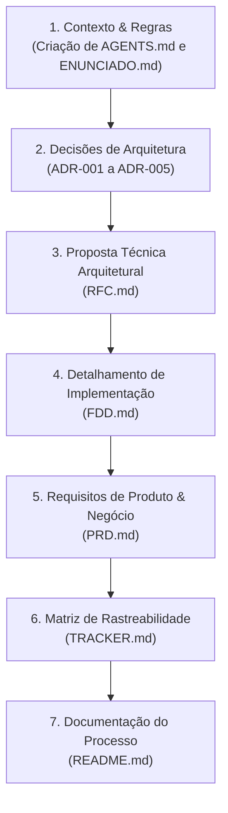

# Documentação do Processo — Desafio MBA: Design Docs com IA

> **Projeto**: Sistema de Webhooks de Notificação de Pedidos (OMS)  
> **Desafio**: Da Reunião ao Documento: Design Docs Gerados por IA  
---

## 1. Sobre o Desafio

Este repositório contém a resolução prática do desafio de MBA "Da Reunião ao Documento: Design Docs Gerados por IA". O objetivo central foi transformar uma reunião técnica real de alinhamento (`TRANSCRICAO.md`) e a análise da codebase existente de um Order Management System (OMS) em um pacote completo, estruturado e profissional de documentos de engenharia e produto (PRD, RFC, FDD, 5 ADRs e Tracker de Rastreabilidade).

A entrega deste projeto é **puramente documental**. Todo o código-fonte (`src/`), modelos do Prisma (`prisma/`) e suítes de teste (`tests/`) permaneceram intactos, servindo exclusivamente como fonte primária para garantir a fidelidade técnica dos contratos, fluxos de integração e especificações de arquitetura.

---

## 2. Ferramentas de IA Utilizadas

Durante a execução da jornada, foram empregadas as seguintes ferramentas e tecnologias de Inteligência Artificial:

- **Google Antigravity / Gemini CLI**: Agente de IA operando em modo pair programming para exploração da codebase, verificação da transcrição, geração de documentos Markdown e execução de comandos de auditoria.
- **Engines de Modelagem Gemini 3.5 e 3.6 Flash**: Utilizados para raciocínio analítico avançado, síntese de transcrições extensas e verificação de rastreabilidade factual.
- **Skills Customizadas:
  - `mba-adr-skill`: Skill especializada na geração de Architectural Decision Records no padrão MADR de 5 seções estritas.
  - `mba-rfc-skill`: Skill para elaboração da proposta técnica arquitetural em nível de RFC.
  - `mba-fdd-skill`: Skill para detalhamento técnico do Feature Design Document com contratos de API e mapeamento de arquivos reais.
  - `mba-prd-skill`: Skill voltada para o levantamento de requisitos de produto, metas quantitativas e escopo.

---

## 3. Workflow Adotado

A estratégia de trabalho seguiu uma abordagem bottom-up rigorosa, garantindo que as decisões arquiteturais fundamentais fossem consolidadas antes de se avançar para a proposta técnica e para os detalhes de implementação:



1. **Definição de Guardrails**: Estabelecimento de `AGENTS.md` para guiar a atuação da IA com regras estritas (sem alteração de código, citação obrigatória de falantes com timestamps, proibição de inventar cargos).
2. **Decisões Isoladas (ADRs)**: Resolução de decisões chave (Outbox Pattern, Worker Polling, Retry/DLQ, HMAC-SHA256, *At-Least-Once* com `X-Event-Id`).
3. **Visão de Arquitetura (RFC)**: Construção da proposta técnica resumida (2-4 páginas) com alternativas descartadas e questões em aberto.
4. **Especificação de Engenharia (FDD)**: Detalhamento dos fluxos, 5 endpoints HTTP completos, matriz de erros `WEBHOOK_*` e integração com 6 arquivos da codebase.
5. **Visão de Produto (PRD)**: Mapeamento de 8 Requisitos Funcionais, meta quantitativa de latência < 10s e riscos.
6. **Auditoria e Rastreabilidade (Tracker)**: Construção da matriz de rastreabilidade de 50 itens mapeando cada documento à transcrição e ao código.

---

## 4. Prompts Customizados

Abaixo estão apresentados dois exemplos de prompts customizados desenvolvidos e utilizados na interação com o agente de IA:

### Prompt 1: Criação e Purificação de ADRs segundo o Formato MADR
```markdown
/skill-creator @/Users/leandromeira/.agents/skills/dev-rfc/ Vamos passar para a fase da RFC agora. Temos uma skill de criação de RFC já referenciada aqui. Porém, no @ENUNCIADO.md temos diretrizes específicas de como a RFC deve ser estruturada e o que deve conter nela. Se baseie na skill dev-rfc para pegar mais contexto, porém crie um skill local
  para a criação da RFC de acordo com os requisitos do enunciado.
```

### Prompt 2: Validação de Rastreabilidade Factual sem Alucinações (Zero Invenção)
```markdown
faça uma revisão extremamente minunciosa de todos os documentos gerado em @docs/ comparando com o @TRANSCRICAO.md , e confira item a item se o timestamp, a pessoa e o assunto condiz com o que está nos docs.
```

---

## 5. Iterações e Ajustes

Durante a interação com o agente de IA, foram identificados pontos onde a resposta inicial da IA continha premissas não comprovadas ou desalinhamentos de formato, exigindo intervenção e correção humana:

- **Iteração 1: Remoção de Cargos Presumidos nos Nomes**:
  - *Problema*: A IA tentou inferir papéis corporativos para os participantes na lista de metadados dos documentos (ex: `Diego (Senior Platform Engineer)`, `Larissa (Tech Lead)`).
  - *Correção*: Intervenção direta exigindo a remoção de qualquer título ou cargo em parênteses. Os nomes foram ajustados para conter estritamente o primeiro nome (`Larissa`, `Marcos`, `Bruno`, `Diego`, `Sofia`), alinhando-se aos fatos da transcrição.
- **Iteração 2: Purificação da Estrutura das ADRs (Remoção de Seções Extras)**:
  - *Problema*: Ao criar os primeiros ADRs, a IA incluiu seções não padrão de mercado como `## Plano de Implementação` e `## Rastreabilidade`.
  - *Correção*: Refatoração dos arquivos para conter estritamente as 5 seções oficiais exigidas pelo template MADR do `ENUNCIADO.md` (`Status/Data/Participantes`, `## Contexto`, `## Decisão`, `## Alternativas Consideradas`, `## Consequências`).
- **Iteração 3: Ajuste na Exibição de Timestamps nos Cabeçalhos**:
  - *Problema*: A IA incluiu timestamps de aparição ao lado dos nomes na linha de metadados do topo dos documentos (ex: `Participantes: Larissa [09:08], Diego [09:06]`).
  - *Correção*: Padronização do cabeçalho para exibir apenas os nomes limpos, reservando a exibição de timestamps `[hh:mm] Nome` exclusivamente para as citações inline no corpo do texto.
- **Iteração 4: Remoção de Métricas de SLA Inventadas (99%) e Extrapolações não ditas**:
  - *Problema*: Durante a auditoria minuciosa dos documentos gerados, identificou-se que a IA inventou métricas de SLA inexistentes na reunião (como *"99% das notificações entregues em menos de 10 segundos"*), métricas em formato Prometheus e planos de contingência não mencionados pelos participantes.
  - *Correção*: Intervenção humana direta para auditar linha a linha o PRD, FDD e ADRs, removendo porcentagens arbitrárias e alinhando o SLA de latência (< 10s), a observabilidade (Pino logger) e os riscos estritamente ao que foi acordado pelos participantes na `TRANSCRICAO.md`.

Não foram necessárias muitas gerações dos documentos, visto que foram implementadas skills que já estava alinhadas a cada tipo de documentação e o que ela deveria conter de acordo com o enunciado. O maior trabalho foi de refatoração, quando precisei garantir que as regras do enunciado estavam sendo seguidas.
---

## 6. Como Navegar a Entrega

A entrega final está organizada no diretório `docs/` e na raiz do projeto. A ordem sugerida para leitura da documentação é a seguinte:

1. **[`ENUNCIADO.md`](./ENUNCIADO.md)**: Requisitos, escopo do desafio do MBA e critérios de aceite oficiais.
2. **[`AGENTS.md`](./AGENTS.md)**: Guia de contexto do projeto e regras operacionais dos agentes de IA.
3. **[`docs/PRD.md`](./docs/PRD.md)**: Product Requirement Document — Visão de produto, requisitos funcionais (FR-001 a FR-008), métricas quantitativas e itens fora de escopo.
4. **[`docs/RFC.md`](./docs/RFC.md)**: Request for Comments — Proposta técnica de arquitetura, alternativas consideradas e questões em aberto.
5. **[`docs/FDD.md`](./docs/FDD.md)**: Feature Design Document — Especificação detalhada de engenharia, contratos públicos HTTP, matriz de erros `WEBHOOK_*` e integração com a codebase.
6. **[`docs/adrs/`](./docs/adrs/)**: Architectural Decision Records (ADRs de 001 a 005):
   - [`ADR-001: Outbox no MySQL`](./docs/adrs/ADR-001-outbox-no-mysql.md)
   - [`ADR-002: Worker Separado em Polling`](./docs/adrs/ADR-002-worker-separado-em-polling.md)
   - [`ADR-003: Retry e Dead Letter Queue`](./docs/adrs/ADR-003-retry-e-dead-letter-queue.md)
   - [`ADR-004: Autenticação HMAC e Rotação de Secrets`](./docs/adrs/ADR-004-autenticacao-hmac-e-rotacao-de-secrets.md)
   - [`ADR-005: Entrega At-Least-Once e Idempotência`](./docs/adrs/ADR-005-entrega-at-least-once-e-idempotencia.md)
7. **[`docs/TRACKER.md`](./docs/TRACKER.md)**: Matriz de Rastreabilidade cruzando 50 itens dos documentos com a transcrição (`TRANSCRICAO.md`) e com o código (`src/`, `prisma/`).
